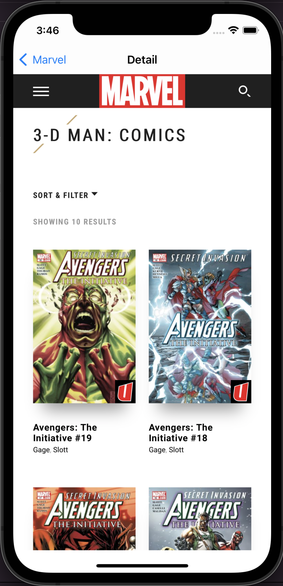

# Marvel-SwiftUI
Marvel iOS SwiftUI es una aplicación escrita en SwiftUI usando los conceptos de la Arquitectura MVVM 🚀.

Contiene la solución alternativa y simple. 
La pantalla de Personajes, muestra todos los personajes a través una consulta a la API de Marvel. Luego lista los resultados y cada Personaje puede ir al detalle a través de una WebView. 

## Requerimientos

- Swift 5.0+
- Xcode 13.0+
- iOS 14.0+ 

## ScreenShots 

| Personajes | Detalle |
| :-: | :-: |
|  |  | 

## Dependencias Usadas

* [**SDWebImageSwiftUI**](https://github.com/SDWebImage/SDWebImageSwiftUI)

## Librerias Usadas

* [**CryptoKit**](https://developer.apple.com/documentation/cryptokit/)
* [**Combine**](https://developer.apple.com/documentation/combine)
* [**WebKit**](https://developer.apple.com/documentation/webkit)

## Instalación

* Descargar el proyecto.
* Esperar hasta que se descarguen las dependencias.
* Seleccionar su Team y regenerar los certificados con su cuenta de Apple. 
* Compilar el proyecto
  
## Author

* [**Maximiliano Morales**](https://github.com/maximorales90)
