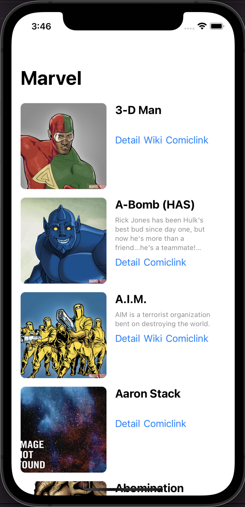
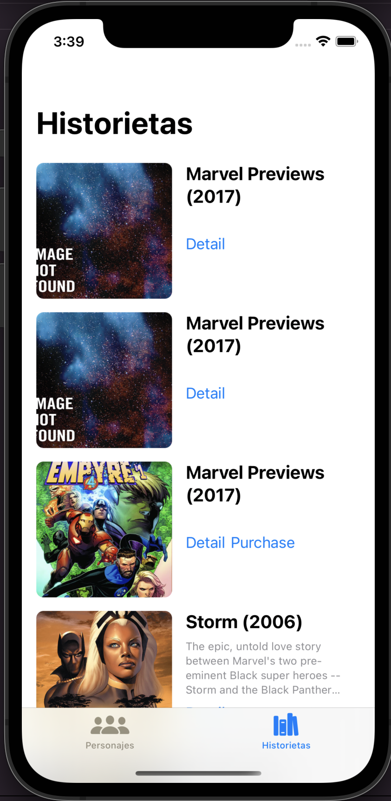

# Marvel-SwiftUI
Marvel iOS SwiftUI es una aplicación escrita en SwiftUI usando los conceptos de la Arquitectura MVVM 🚀.

Contiene la solución final con una barra de búsqueda, un TabBar para intercambiar pantallas. 
La pantalla de personajes, muestra solamente los personajes a través de las Querys de nombre comienza con.. realizadas a través de una consulta a la API de Marvel. Luego lista los resultados y cada personaje puede ir al detalle a través de una WebView.
La pantalla de Historietas, muestra todas las historietas a través de una consulta a la API de Marvel. Luego lista los resultados y cada Historieta puede ir al detalle a través de una WebView.

## Requerimientos

- Swift 5.0+
- Xcode 13.0+
- iOS 14.0+ 

## ScreenShots 
| Personajes | Búsqueda | Detalle | Historietas |
| :-: | :-: | :-: | :-: |
|  |  |  |  |

## Dependencias Usadas

* [**SDWebImageSwiftUI**](https://github.com/SDWebImage/SDWebImageSwiftUI)

## Librerias Usadas

* [**CryptoKit**](https://developer.apple.com/documentation/cryptokit/)
* [**Combine**](https://developer.apple.com/documentation/combine)
* [**WebKit**](https://developer.apple.com/documentation/webkit)

## Instalación

* Descargar el proyecto.
* Verificar que se descarguen las dependencias.
* Seleccionar su Team y regenerar los certificados con su cuenta de Apple. 
* Compilar el proyecto
  
## Author

* [**Maximiliano Morales**](https://github.com/maximorales90)
